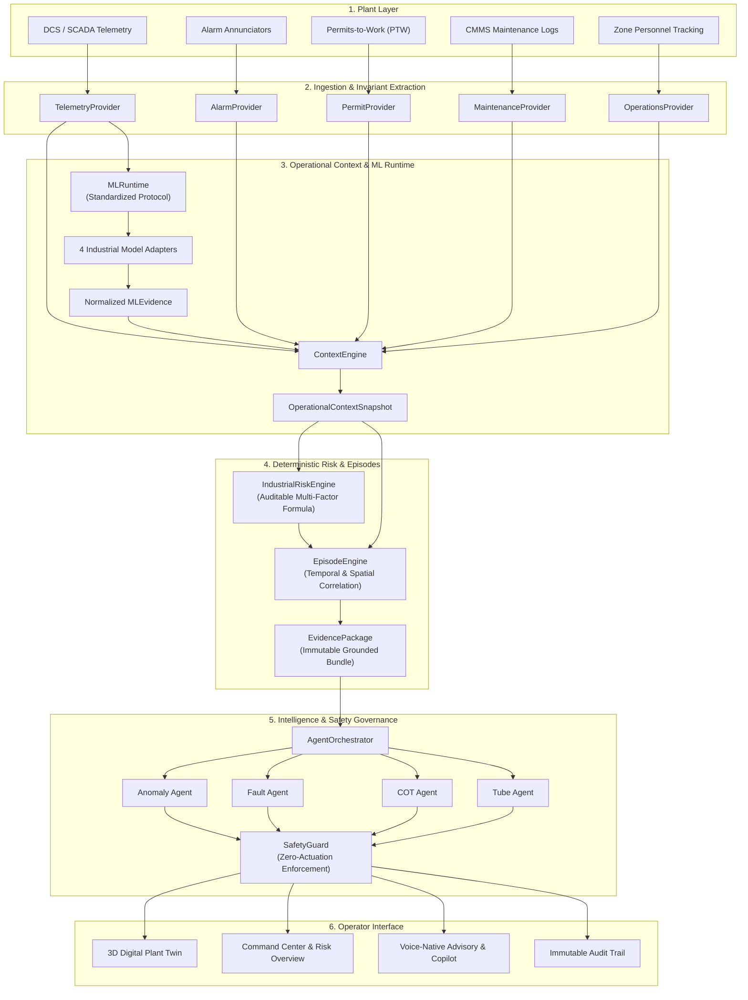
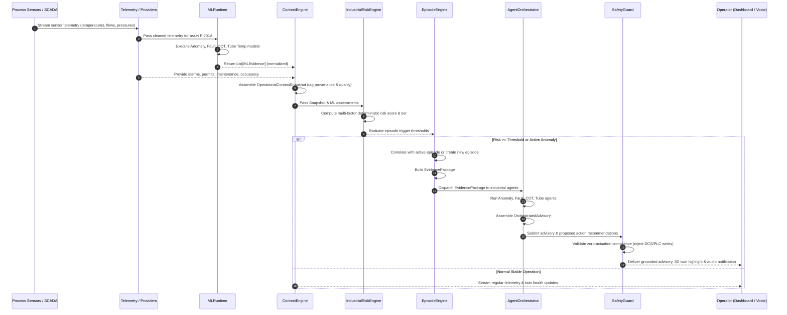
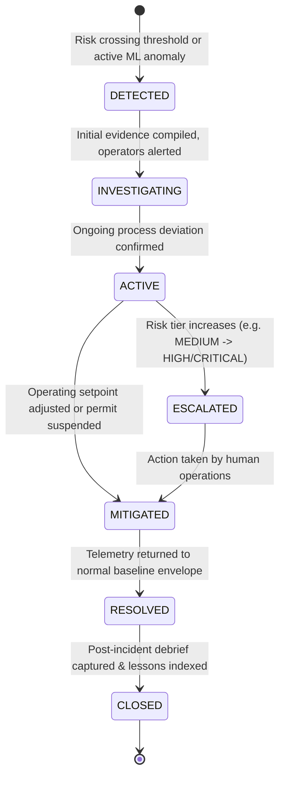
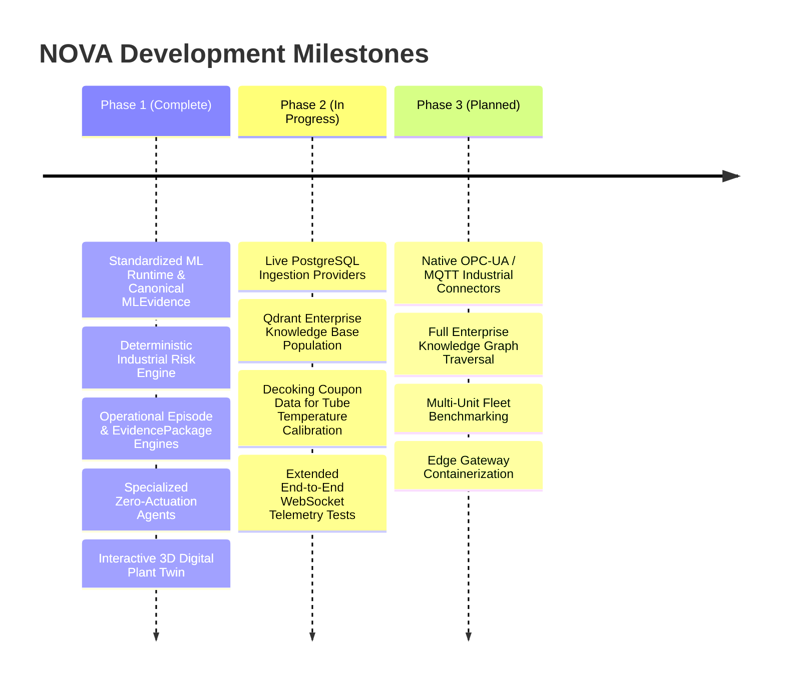

# NOVA — Industrial Operational Intelligence Platform

> **Advisory-Only Compound-Risk Intelligence & Decision-Support System for Continuous Process Plants**


---

## Executive Overview

**NOVA** is an industrial operational-intelligence platform engineered for continuous process facilities — including ethylene cracking units, petrochemical refineries, and chemical processing complexes.

Modern continuous process plants run thousands of instruments, distributed control loops (DCS), supervisory safety instrumented systems (SIS), and permit-to-work registers. While individual control loops stabilize specific process variables, industrial catastrophic incidents routinely occur not from a single catastrophic instrument failure, but from **compound risk**: weak, sub-alarm operational deviations simultaneously coinciding with equipment degradation, active high-hazard work permits (e.g., hot work), simultaneous operations (SIMOPS), and personnel presence.

NOVA bridges the operational gap between isolated sensor telemetry, predictive machine learning models, plant operating context, deterministic risk evaluation, and human operations teams. It continuously ingests process telemetry, runs ML inference across standardized model contracts, synthesizes an auditable **Operational Context Snapshot**, calculates deterministic multi-factor risk scores, groups related process anomalies into **Operational Episodes**, compiles structured **EvidencePackages**, and drives specialized engineering agents to generate grounded, actionable advisories.

> [!IMPORTANT]
> **Safety Boundary & Advisory Mandate:**
> NOVA operates strictly in a **Read-Only / Decision-Support / Advisory** capacity. NOVA has **zero direct control authority** over programmable logic controllers (PLC), distributed control systems (DCS), safety instrumented systems (SIS), or emergency shutdown (ESD) loops. Actuation and setpoint modifications remain the sole responsibility of certified human operators and certified physical safety interlocks.

---

## Table of Contents

- [The Industrial Problem](#the-industrial-problem)
  - [The Reality of Industrial Monitoring](#the-reality-of-industrial-monitoring)
  - [Why Conventional Monitoring Fails](#why-conventional-monitoring-fails)
  - [The Need for Compound Intelligence](#the-need-for-compound-intelligence)
- [The NOVA Solution](#the-nova-solution)
  - [Conceptual Pipeline](#conceptual-pipeline)
  - [What NOVA Does](#what-nova-does)
  - [What NOVA Deliberately Does NOT Do](#what-nova-deliberately-does-not-do)
- [Target Stakeholders](#target-stakeholders)
- [System Architecture](#system-architecture)
  - [High-Level Architecture](#high-level-architecture)
  - [Architectural Layers](#architectural-layers)
  - [End-to-End Runtime Data Flow](#end-to-end-runtime-data-flow)
- [Industrial Intelligence Pipeline](#industrial-intelligence-pipeline)
  - [1. Telemetry Ingestion & Provider Layer](#1-telemetry-ingestion--provider-layer)
  - [2. Standardized ML Runtime & Contracts](#2-standardized-ml-runtime--contracts)
  - [3. Operational Context Engine](#3-operational-context-engine)
  - [4. Deterministic Industrial Risk Engine](#4-deterministic-industrial-risk-engine)
  - [5. Operational Episode Lifecycle](#5-operational-episode-lifecycle)
  - [6. Canonical EvidencePackage](#6-canonical-evidencepackage)
  - [7. Specialized Industrial Intelligence Agents](#7-specialized-industrial-intelligence-agents)
  - [8. SafetyGuard Policy Boundary](#8-safetyguard-policy-boundary)
- [Machine Learning Subsystem](#machine-learning-subsystem)
  - [Model Inventory & Truth Status](#model-inventory--truth-status)
  - [Process Anomaly Detector (TEP)](#process-anomaly-detector-tep)
  - [Process Fault Classifier (TEP)](#process-fault-classifier-tep)
  - [Furnace Coil Outlet Temperature (COT) Predictor](#furnace-coil-outlet-temperature-cot-predictor)
  - [Tube Temperature Soft Sensor](#tube-temperature-soft-sensor)
  - [ML Training Gate & Data Curating](#ml-training-gate--data-curating)
- [MLEvidence Contract & Uncertainty Handling](#mlevidence-contract--uncertainty-handling)
- [Provider Architecture & Extension Points](#provider-architecture--extension-points)
  - [Supported Provider Interfaces](#supported-provider-interfaces)
  - [Drop-in Integration Model](#drop-in-integration-model)
- [Knowledge, Memory & RAG](#knowledge-memory--rag)
- [Data & Persistence Architecture](#data--persistence-architecture)
- [Frontend User Interface](#frontend-user-interface)
  - [Application Pages & Routes](#application-pages--routes)
  - [3D Digital Plant Twin](#3d-digital-plant-twin)
  - [Frontend-to-Backend Connection Status](#frontend-to-backend-connection-status)
- [API Reference](#api-reference)
  - [Industrial Endpoints](#industrial-endpoints)
  - [Risk & ML Endpoints](#risk--ml-endpoints)
  - [Episode & Copilot Endpoints](#episode--copilot-endpoints)
  - [WebSocket Endpoints](#websocket-endpoints)
- [Technology Stack](#technology-stack)
- [Repository Structure](#repository-structure)
- [Installation & Setup](#installation--setup)
- [Configuration & Environment Variables](#configuration--environment-variables)
- [Running NOVA](#running-nova)
- [Simulator & Replay Capabilities](#simulator--replay-capabilities)
- [Testing & Quality Verification](#testing--quality-verification)
- [Current Implementation Status](#current-implementation-status)
- [Known Limitations](#known-limitations)
- [Project Roadmap](#project-roadmap)
- [Security, Audit & Governance](#security-audit--governance)
- [Development Guidelines](#development-guidelines)
- [Contributing](#contributing)
- [License & Legal Disclaimer](#license--legal-disclaimer)

---

## The Industrial Problem

### The Reality of Industrial Monitoring

In large-scale continuous petrochemical and chemical operations (such as ethylene cracking furnaces, separation trains, and hydrocrackers), operational data is distributed across disconnected silos:

* **Process Telemetry (SCADA/DCS):** Streams hundreds of sensor readings per second (temperatures, differential pressures, flow rates, analyzer compositions).
* **Alarm Systems:** Generate thousands of standing, high-priority, or chattering alarm notifications during transient states (alarm flooding).
* **Permit-to-Work (PTW) Registers:** Record authorized work permits (e.g., Hot Work, Confined Space Entry, Line Breaking) in separate databases or physical binders.
* **Maintenance Management (CMMS):** Tracks overdue preventative maintenance, vibration flags, packing leaks, and degraded pump seals.
* **Personnel Location Systems:** Track badge scans and operational occupancy across hazardous process zones.

### Why Conventional Monitoring Fails

Conventional industrial monitoring depends on independent thresholds configured on individual instruments (e.g., `TI-20101 > 850°C ALARM_HIGH`). This architecture introduces critical blind spots:

1. **Sub-Threshold Compound Vulnerability:** A furnace coil temperature running 4°C below its alarm limit is ignored by SCADA. A feed composition shift with minor acetylene slippage is not an alarm. A hot-work welding permit active in Bay 3 is routine paperwork. A cooling water valve with 8% sticking is a minor maintenance ticket. None of these signals breach an alarm threshold individually. **Together, within the same process train and 20-minute window, they represent the precursor conditions for coil coking, tube burnout, or hydrocarbon release.**
2. **Alarm Flooding & Operator Desensitization:** During process upsets, a single hydraulic surge can trigger 200 alarms in 60 seconds. Control room operators are overwhelmed by raw annunciators and struggle to diagnose the true root cause.
3. **Context Blindness:** Machine learning models deployed as black boxes often predict failure without awareness of plant operating mode (e.g., Startup vs. Normal Steady-State vs. Turndown), active maintenance bypasses, or instrument health.
4. **Historical Disconnection:** Previous near-misses, root-cause investigations (RCA), and standard operating procedures (SOPs) are stored in static PDFs, unreachable when an operator needs them in real time.

```
Individual Signals (Seemingly Normal):
[Gas Analyzer: +3% C2H2] + [Valve FV-101: 5% Stiction] + [Active Hot-Work Permit] + [Shift Changeover]
                                      │
                         DCS Threshold Monitor: PASS
                                      │
                      NOVA Compound Intelligence:
          CRITICAL RISK: Potential thermal runaway & SIMOPS hazard in Bay 3
```

---

## The NOVA Solution

### Conceptual Pipeline

NOVA introduces a unified, evidence-based intelligence pipeline that continuously translates raw telemetry into grounded operator advisory:



### What NOVA Does

* **Normalizes Telemetry & Quality:** Validates instrument readings, identifies stale signals, tags data quality (`GOOD`, `UNCERTAIN`, `BAD`, `MISSING`), and tracks data provenance (`OBSERVED`, `PREDICTED`, `DERIVED`).
* **Runs Standardized ML Inference:** Integrates machine learning models through a uniform, typed protocol (`MLEvidence`) without silent failures or NaN replacements.
* **Maintains Plant Operating Context:** Tracks plant operating modes (`NORMAL`, `STARTUP`, `SHUTDOWN`, `TURNDOWN`, `MAINTENANCE`, `EMERGENCY`) so process thresholds adapt to real operating phases.
* **Evaluates Deterministic Risk:** Computes compound risk using auditable multi-factor arithmetic incorporating anomaly scores, equipment health, alarm tiers, active permits, SIMOPS overlap, and personnel density.
* **Correlates Operational Episodes:** Groups related anomalies across equipment trains over rolling time windows into stateful operational episodes (`DETECTED` → `INVESTIGATING` → `ACTIVE` → `ESCALATED` → `MITIGATED` → `RESOLVED` → `CLOSED`).
* **Compiles Canonical EvidencePackages:** Packages the complete context, observations, model outputs, risks, and references into a tamper-evident, self-contained record.
* **Delivers Grounded Operator Advisory:** Coordinates domain-specialized industrial agents to synthesize clear explanations, root-cause hypotheses, and prioritized, human-verifiable mitigation steps.

### What NOVA Deliberately Does NOT Do

* **NOVA does NOT write to PLCs, DCS, or field controllers.**
* **NOVA does NOT change valve positions, pump speeds, or process setpoints.**
* **NOVA does NOT bypass or override Safety Instrumented Systems (SIS) or ESD trips.**
* **NOVA does NOT delegate risk classification or safety decisions to generative LLM outputs.**
* **NOVA does NOT invent or hallucinate physical process limits.**
* **NOVA does NOT replace certified control room operators or process safety engineers.**

---

## Target Stakeholders

| Stakeholder Role | How NOVA Serves This Role | Primary Interface |
|---|---|---|
| **Board / Control Room Operator** | Real-time situational awareness, early compound risk alerts before alarms trip, rapid fault hypotheses during process upsets. | Command Center, Digital Twin, Proactive Audio Advisory |
| **Process / Operations Engineer** | Coil outlet temperature (COT) residual tracking, heat exchanger fouling alerts, operating envelope adherence, process anomaly diagnostics. | Analytics Dashboard, Equipment Detail Views, Context Snapshots |
| **Plant Safety / HSE Officer** | Identification of dangerous SIMOPS (simultaneous operations), hot-work permits overlapping degraded equipment, personnel occupancy in high-risk zones. | Risk Overview, Alerts Page, Safety Audit Logs |
| **Reliability / Maintenance Team** | Early detection of equipment health degradation, vibration correlations, historical failure comparisons, post-incident debriefs. | Equipment Page, Episode History, CMMS Links |
| **Data / ML Engineering Team** | Clean, typed runtime contracts (`MLEvidence`), drop-in provider interfaces, decoupled training gates, reproducible evaluation metrics. | ML Runtime, Model Registry, Training Gate Tests |

---

## System Architecture

### High-Level Architecture

```mermaid
graph LR
    subgraph Ingestion["INGESTION & TOPOLOGY"]
        PS["PlantStateService"]
        TP["TelemetryProvider"]
        AP["AlarmProvider"]
        PP["PermitProvider"]
        MP["MaintenanceProvider"]
        OP["OperationsProvider"]
    end

    subgraph IntelligenceCore["NOVA BACKEND INTELLIGENCE CORE"]
        CE["ContextEngine"]
        MLR["MLRuntime Orchestrator"]
        CRB["ContextRiskBridge"]
        IRE["IndustrialRiskEngine"]
        EE["EpisodeEngine"]
        EP["EvidencePackage Assembly"]
        AO["AgentOrchestrator"]
        SG["SafetyGuard Boundary"]
    end

    subgraph Storage["DATA & PERSISTENCE"]
        SQL["SQLite / PostgreSQL<br/>(Operational DB)"]
        QDR["Qdrant Vector Store<br/>(Semantic & Incident Memory)"]
        ART["Model Artifact Registry<br/>(Joblib / YAML)"]
    end

    subgraph Presentation["OPERATOR INTERFACE"]
        FE["React 18 Dashboard & 3D Twin"]
        WS["WebSocket Telemetry & Audio Bridge"]
        REST["FastAPI REST Endpoints"]
    end

    Ingestion --> CE
    Ingestion --> MLR
    MLR --> CE
    CE --> CRB --> IRE
    CE & IRE --> EE --> EP
    EP --> AO --> SG
    Storage <--> Ingestion
    Storage <--> CE
    SG --> REST & WS
    REST & WS --> FE
```



### Architectural Layers

| Layer | Responsibility | Input | Output | Status |
|---|---|---|---|---|
| **1. Ingestion / Providers** | Abstraction of industrial data feeds (SCADA, alarms, work orders, permits, occupancy). | Real-time sensor frames, database rows, MQTT/REST packets. | Strongly-typed domain dicts conforming to Provider ABCs. | ✅ **Implemented** (default PlantState providers live; real DB providers ready for hookup) |
| **2. State & Feature Layer** | Authoritative in-memory plant snapshot, rolling windows, derived features. | Provider queries, raw telemetry feeds. | `PlantState`, feature vectors for inference. | ✅ **Implemented** |
| **3. ML Runtime** | Model inference dispatch, error isolation, output normalization. | Raw numeric telemetry dict, target asset ID. | Normalized `List[MLEvidence]` records. | ✅ **Implemented** (supports real models & mock fallbacks) |
| **4. Context Engine** | Synthesis of unified operational context snapshot with provenance and quality tags. | Telemetry, active alarms, permits, maintenance, occupancy, MLEvidence. | `OperationalContextSnapshot`. | ✅ **Implemented** |
| **5. Risk Engine** | Deterministic multi-factor industrial risk computation and threshold gating. | `OperationalContextSnapshot`, asset criticality, operating limits. | `IndustrialRiskAssessment` with breakdown & risk tier. | ✅ **Implemented** |
| **6. Episode Engine** | Spatiotemporal correlation of related observations into ongoing operational cases. | Observations, telemetry anomalies, alarms, risk assessments. | `OperationalEpisode` lifecycle tracking. | ✅ **Implemented** |
| **7. Evidence Layer** | Immutable bundling of all facts, models, risks, and references for decision-support. | Episode, Snapshot, Risk, Context, Historical precedents. | `EvidencePackage`. | ✅ **Implemented** |
| **8. Agent Intelligence** | Specialized engineering agents executing structured, evidence-grounded reasoning. | `OperationalContextSnapshot`, `IndustrialRiskAssessment`, `EvidencePackage`. | `OrchestratedAdvisory` with prioritized actions. | ✅ **Implemented** |
| **9. Safety & Policy Layer** | Structural enforcement of read-only advisory boundary; rejects control commands. | Proposed actions, agent outputs, API requests. | Allowed advisory or `DirectControlAttemptError`. | ✅ **Implemented** |
| **10. API & WebSockets** | REST routing, OpenAPI documentation, live telemetry broadcasting, audio stream bridge. | Client HTTP requests, WebSocket connections, internal event bus. | JSON responses, binary audio streams, SSE events. | ✅ **Implemented** |
| **11. Frontend Layer** | Operator dashboard, 3D interactive plant twin, equipment drawer, alert management. | REST APIs, WebSocket stream from `/ws/session`. | Interactive visual rendering and operator input. | ✅ **Implemented** (connected via Realtime Store) |

### End-to-End Runtime Data Flow



---

## Industrial Intelligence Pipeline

### 1. Telemetry Ingestion & Provider Layer

The ingestion layer decouples NOVA's core reasoning algorithms from the underlying storage technology through abstract provider interfaces (`interfaces.py`):
* `TelemetryProvider`: Fetches latest readings, historical time windows, and sensor health.
* `AlarmProvider`: Queries active and historical industrial annunciator alarms.
* `AssetProvider`: Provides plant asset topology, equipment criticality, and operating status.
* `MaintenanceProvider`: Retrieves active work orders and scheduled maintenance.
* `PermitProvider`: Tracks Permit-to-Work (PTW) statuses and SIMOPS flags.
* `OperationsProvider`: Supplies operating mode and zone personnel occupancy.
* `HistoricalEpisodeProvider`: Searches past incidents and post-event lessons.
* `KnowledgeProvider`: Queries engineering standard operating procedures (SOPs) and physical operating limits.

### 2. Standardized ML Runtime & Contracts

The `MLRuntime` orchestrates model execution across structural protocols:
* **Uniform Prediction Call:** Any model implementing `predict(telemetry, asset_id) -> MLEvidence` satisfies `MLModelProtocol`.
* **Graceful Degradation:** If an individual model crashes or throws an exception, the runtime isolates the error and generates an `MLEvidence` record with `status=INFERENCE_ERROR` and `quality=NOT_AVAILABLE`. The pipeline continues without crashing.
* **Pluggable Architecture:** Supports real model adapters (wrapping production joblib/pickle weights) or controlled mock models (`MockAnomalyModel`, `MockFaultModel`, `MockCOTModel`, `MockTubeTempModel`) for testing and offline development.

### 3. Operational Context Engine

The `ContextEngine` assembles an authoritative `OperationalContextSnapshot`. It enforces rigorous **data provenance**:
* `OBSERVED`: Raw instrumentation values read directly from field telemetry.
* `PREDICTED`: Values derived from machine learning inference or soft sensors.
* `DERIVED`: Values calculated deterministically (e.g., residual differences, statistical aggregations).
* `MISSING`: Expected instrument tags missing from the incoming payload.
* `STALE`: Measurements whose timestamp exceeds maximum allowable latency thresholds.
* `UNKNOWN`: Sensor or asset identifiers not present in the plant topology registry.

### 4. Deterministic Industrial Risk Engine

Risk assessment in NOVA is strictly **deterministic and auditable**. Generative AI models are never allowed to invent or calculate risk scores.

The `IndustrialRiskEngine` evaluates multi-factor risk across seven physical dimensions:

$$\text{Risk Score} = w_{\text{anom}} S_{\text{anom}} + w_{\text{cond}} (1 - H_{\text{equip}}) + w_{\text{alarm}} A_{\text{sev}} + w_{\text{permit}} P_{\text{act}} + P_{\text{SIMOPS}} + w_{\text{occ}} O_{\text{zone}} + w_{\text{crit}} C_{\text{asset}}$$

| Factor | Description | Weight |
|---|---|---|
| **Process Anomaly Score ($S_{\text{anom}}$)** | Output from PCA + Isolation Forest model ($0.0 - 1.0$). | 0.25 |
| **Equipment Degradation ($1 - H_{\text{equip}}$)** | Complement of equipment health ($0.0 = \text{Healthy}, 1.0 = \text{Degraded}$). | 0.20 |
| **Alarm Severity ($A_{\text{sev}}$)** | Highest active alarm tier (`NONE`=0.0, `LOW`=0.25, `MEDIUM`=0.5, `HIGH`=0.75, `CRITICAL`=1.0). | 0.20 |
| **Active Permit ($P_{\text{act}}$)** | Active work permit in the area ($1.0$ if present, else $0.0$). | 0.10 |
| **SIMOPS Hazard Penalty ($P_{\text{SIMOPS}}$)** | Simultaneous high-hazard operations (hot work + maintenance + hydrocarbons). | 0.10 |
| **Zone Personnel Density ($O_{\text{zone}}$)** | Scaled count of personnel exposed in the hazard zone. | 0.05 |
| **Asset Criticality ($C_{\text{asset}}$)** | Strategic asset rating (`LOW`=0.25, `MEDIUM`=0.5, `HIGH`=0.75, `CRITICAL`=1.0). | 0.10 |

The composite score maps directly to four operational risk tiers:
* **`LOW`** ($< 0.35$): Normal operating envelope. Advisory logging only.
* **`MEDIUM`** ($0.35 - 0.59$): Minor process deviation. Operator notification.
* **`HIGH`** ($0.60 - 0.79$): Significant compound deviation. Engineering attention required.
* **`CRITICAL`** ($\ge 0.80$): Imminent hazard or major operating boundary violation. Immediate supervisory alert.

### 5. Operational Episode Lifecycle

The `EpisodeEngine` manages operational incidents as stateful entities over time, correlating multiple events that stem from the same root cause:



### 6. Canonical EvidencePackage

The `EvidencePackage` is the central data bundle passed to downstream agents, operators, and audit stores. It aggregates:
* Unique package ID, UTC timestamp, plant ID, unit ID, and target asset ID.
* Complete `OperationalContextSnapshot`.
* All normalized `MLEvidence` records with model versions and status codes.
* The deterministic `IndustrialRiskAssessment` with rule trace.
* Active alarms, active maintenance records, active work permits, and zone occupancy.
* References to relevant historical incidents and engineering procedures.
* Complete data provenance tags.

### 7. Specialized Industrial Intelligence Agents

NOVA utilizes four specialized industrial agents coordinated by an `AgentOrchestrator`. Each agent operates with defined scope and strict zero-actuation constraints:

1. **`AnomalyIntelAgent` (Process Anomaly Specialist):**
   * *Scope:* Interprets statistical anomaly scores from the Process Anomaly Detector.
   * *Responsibility:* Identifies whether an anomaly represents slow drift, transient excursion, or sustained deviation. Determines process severity tier.
2. **`FaultDiagnosisAgent` (Process Fault Specialist):**
   * *Scope:* Evaluates top-K fault classifications from the 21-class TEP Fault Classifier.
   * *Responsibility:* Maps mathematical fault identifiers (e.g., `IDV(1)` to `IDV(20)`) to concrete process explanations (feed composition shifts, condenser fouling, valve sticking). Flags high-hazard runaway faults.
3. **`COTMonitorAgent` (Furnace Thermal Specialist):**
   * *Scope:* Evaluates predicted vs. actual Coil Outlet Temperature (COT).
   * *Responsibility:* Computes residuals ($\Delta T = \text{Actual} - \text{Predicted}$), monitors thermal drift, and warns if predicted values exceed design metallurgy limits (e.g., $> 850^\circ\text{C}$).
4. **`TubeIntegrityAgent` (Tube Metallurgy Specialist):**
   * *Scope:* Analyzes tube metal temperature (TMT) soft-sensor predictions.
   * *Responsibility:* Detects localized hot spots and temperature disparities. *Note: Explicitly excludes uncalibrated coking index claims unless backed by a validated model target.*
5. **`AgentOrchestrator`:**
   * *Scope:* Aggregates findings from all specialized agents, resolves conflicting assessments, computes overall advisory severity, and renders clean operator advisories.

### 8. SafetyGuard Policy Boundary

NOVA includes an enforced safety barrier (`backend/policy_engine/safety_guard.py`):
```python
PROHIBITED_COMMAND_PATTERNS = [
    "plc_write", "dcs_write", "sis_command", "esd_command",
    "setpoint_change", "actuator_control", "override_interlock", "force_output"
]
```
Any attempt by an agent, user, or automated workflow to execute a prohibited command raises a fatal `DirectControlAttemptError` and writes a security violation alert to the audit trail.

---

## Machine Learning Subsystem

### Model Inventory & Truth Status

NOVA maintains an explicit distinction between validated models, baseline models, and scaffolds:

| Model Identifier | Target Asset | Algorithm / Architecture | Version | Implementation Status | Training Source / Dataset | Key Evaluation Metrics |
|---|---|---|---|---|---|---|
| **Process Anomaly Detector** | Plant-Wide / TEP Train | PCA (31 components) + Isolation Forest | `v1.1.0` | ✅ **VALIDATED_WITH_LIMITATIONS** | Tennessee Eastman Process (TEP) Canonical Dataset | **ROC-AUC:** 0.8055<br/>**PR-AUC:** 0.6758<br/>**Precision:** 0.7123<br/>**FPR (Normal State):** 0.0086 |
| **Process Fault Classifier** | Chemical Separation Train | XGBoost Multiclass Classifier (21 classes) | `v1.1.0` | ✅ **VALIDATED_WITH_LIMITATIONS** | TEP Canonical Dataset (simulation-run isolated splits) | **Accuracy:** 80.28%<br/>**Top-3 Accuracy:** 91.63%<br/>**Top-5 Accuracy:** 96.95%<br/>**Macro F1:** 0.8164 |
| **Furnace COT Predictor** | Ethylene Cracking Furnace (`F-201A`) | XGBoost Gradient Boosted Regression | `v1.0.0` | ✅ **READY** (Trained Baseline) | Authentic Ethylene Furnace Telemetry (30,015 records) | **MAE:** 1.6601°C<br/>**RMSE:** 2.0679°C<br/>**R² Score:** 0.9972<br/>**MAPE:** 0.193% |
| **Tube Temperature Predictor** | Furnace Radiator Coils | XGBoost / LSTM Soft Sensor | `tube-temp-softsensor-v1` | 🟡 **NOT TRAINED** (Design / Training Script Available) | Physics-Informed Synthetic Dataset | *Target is synthetic radial heat transfer equation output; not field measured.* |

### Process Anomaly Detector (TEP)

* **Purpose:** Unsupervised early detection of process excursions before physical alarm limits are breached.
* **Methodology:** Projects 52 continuous process variables into a 31-component PCA subspace (retaining 90.13% variance) to capture linear correlation breakdown, followed by an Isolation Forest to score subspace outliers.
* **Limitations:** Recall is 44.86% because subtle disturbances (such as IDV 3, 9, 15) remain within steady-state variance envelopes for extended periods.

### Process Fault Classifier (TEP)

* **Purpose:** Diagnoses specific industrial root-cause failure modes across 21 discrete classes (Class 0: Normal Operation; Classes 1–20: Specific Tennessee Eastman process disturbances).
* **Input Features:** 156 engineered features derived from 3-step sliding window dynamics (mean, delta, acceleration) across 52 process measurements.
* **Split Strategy:** Strict simulation-run isolation (10 runs training, 2 runs validation, 4 runs testing per fault class) to eliminate data leakage across temporal sequences.

### Furnace Coil Outlet Temperature (COT) Predictor

* **Purpose:** Continuous prediction of ethylene cracking furnace Coil Outlet Temperature (°C) to monitor thermal efficiency, detect burner imbalances, and identify coking-related thermal drift.
* **Dataset:** 30,015 operational telemetry records from an industrial cracking furnace. Features include hydrocarbon cracked-gas fractions ($C_2H_2, C_2H_4, C_2H_6, C_3H_6, C_4H_6, CH_4$, etc.), furnace pressure, and gas temperatures.
* **Performance:** MAE of 1.66°C against a operating range of 750°C–870°C ($R^2 = 0.9972$).

### Tube Temperature Soft Sensor

* **Status:** The model is currently classified as `not_trained` in the model registry.
* **Target Provenance:** The target variable (`TMT`) in `ml_training/tube_temperature/` is explicitly declared as **"physics-informed synthetic"**, derived from 1D radial conductive and convective heat-transfer equations. It is **NOT** physical thermocouple data measured in a live furnace.
* **Caution:** NOVA's intelligence agents are explicitly prohibited from citing this model as a certified coking detector until physical decoking coupon data is integrated.

### ML Training Gate & Data Curating

To ensure absolute separation between unvetted raw data and certified training pipelines, NOVA implements an automated security gate (`ml_training/common/training_gate.py`):
1. **Curated-Only Ingestion:** Models may only be trained from datasets in `data/curated/`. Any attempt to train directly from `data/raw/` or `data/cleaned/` fails closed.
2. **Cryptographic Checksums:** Datasets must match the exact SHA-256 hashes recorded in signed JSON manifests.
3. **Zero Target Leakage:** Validates that target variables are strictly excluded from feature sets prior to model fitting.

---

## MLEvidence Contract & Uncertainty Handling

All machine learning model outputs are strictly normalized into a canonical Pydantic model (`backend/ml/runtime/contracts.py`):

```python
class MLEvidence(BaseModel):
    model_name: str
    model_version: str
    prediction_type: MLPredictionType  # ANOMALY | FAULT_CLASSIFICATION | COT_PREDICTION | TUBE_TEMPERATURE
    asset_id: str
    timestamp: datetime
    status: MLEvidenceStatus            # OK | MODEL_NOT_AVAILABLE | INVALID_INPUT | INFERENCE_ERROR
    prediction: Optional[Dict[str, Any]] = None
    confidence: Optional[float] = None
    units: Optional[str] = None
    quality: MLEvidenceQuality          # GOOD | UNCERTAIN | BAD | NOT_AVAILABLE
    features_used: List[str] = Field(default_factory=list)
    provenance: Dict[str, Any] = Field(default_factory=dict)
    source: str = "runtime"            # "runtime" | "mock" | "offline"
```

### Strict Rules for Missing Data

* When a model is offline or uninstalled: `status = MODEL_NOT_AVAILABLE`, `prediction = None`, `confidence = None`.
* **NOVA NEVER substitutes `0.0` or fake placeholders for missing predictions.** Replacing missing predictions with default values would deceive downstream risk formulas into believing the plant is running with zero anomalies.
* Confidence is only populated when calibrated probabilities exist; regression outputs (e.g., COT °C) leave `confidence = None`.

---

## Provider Architecture & Extension Points

### Supported Provider Interfaces

Located in `backend/services/providers/interfaces.py`, eight abstract base classes define all external data dependencies:

```
Intelligence Layer (ContextEngine, RiskEngine, Episodes, Agents)
                            │
              Provider Abstract Base Classes
 ┌──────────────────────────┼──────────────────────────┐
 ▼                          ▼                          ▼
TelemetryProvider     AlarmProvider              PermitProvider
AssetProvider         MaintenanceProvider        OperationsProvider
HistoricalEpisodeProvider KnowledgeProvider
```

### Drop-in Integration Model

NOVA is currently configured with default implementations backed by `PlantStateService` and in-memory caches (`default_providers.py`). Integrating live enterprise systems requires **zero changes** to context, risk, episode, or agent logic:

| Enterprise System | Target Provider Interface | Integration Implementation |
|---|---|---|
| **OSIsoft PI / Aspen InfoPlus.21** | `TelemetryProvider` | Implement `get_latest()` and `get_window()` via PI Web API or OPC-UA. |
| **Honeywell / Yokogawa Alarm DB** | `AlarmProvider` | Implement `get_active_alarms()` querying sequence-of-events (SOE) logs. |
| **SAP PM / Maximo** | `MaintenanceProvider` | Implement `get_active_maintenance()` querying CMMS REST APIs. |
| **eVision / Enablon PTW** | `PermitProvider` | Implement `get_active_permits()` and `is_simops_active()`. |
| **Qdrant Vector Database** | `KnowledgeProvider` | Implement `search_knowledge()` for engineering procedures. |
| **Neo4j / Graph DB** | `HistoricalEpisodeProvider`| Implement `search_similar_episodes()` for incident precedent matching. |

---

## Knowledge, Memory & RAG

NOVA includes infrastructure for organizational and incident memory retrieval:
* **Vector Store Integration:** `backend/memory/client.py` connects to local or cloud instances of **Qdrant**.
* **Collections Configured:**
  * `incidents_historical`: Historical operational deviations, equipment failures, and near-miss investigations.
  * `lessons_learned`: Verified operator post-incident debriefs and corrective actions.
  * `sop_procedures`: Plant standard operating procedures and emergency mitigation steps.
* **Embeddings & Reranking:**
  * Embeddings: `BAAI/bge-small-en-v1.5` (local inference via `sentence-transformers`).
  * Cross-Encoder Reranker: `BAAI/bge-reranker-base`.
* **Current Status:**
  * *Implemented:* Qdrant collection schemas, embedding pipelines, retrieval endpoints (`/api/memory/search`), and fallback keyword matching.
  * *Planned / Arushi Integration:* Full enterprise knowledge graph linking incident nodes to equipment tags and SOP hierarchies.

---

## Data & Persistence Architecture

NOVA uses a multi-tier persistence design tailored for high-speed industrial telemetry and long-term compliance:

```
┌─────────────────────────────────────────────────────────────────┐
│                     Plant Telemetry Influx                      │
└────────────────┬───────────────────────────────┬────────────────┘
                 ▼                               ▼
  ┌──────────────────────────────┐ ┌──────────────────────────────┐
  │      Authoritative DB        │ │     Qdrant Vector Store      │
  │    (SQLite / PostgreSQL)     │ │                              │
  │                              │ │  - Incident Embeddings       │
  │  - Plant Topology & Assets   │ │  - SOP Documents             │
  │  - Active Alarms & Permits   │ │  - Post-Incident Debriefs    │
  │  - Operational Episodes      │ │                              │
  │  - Immutable Audit Trail     │ │                              │
  └──────────────────────────────┘ └──────────────────────────────┘
```

1. **Relational Database (`SQLite` / `PostgreSQL`):**
   * Default local development uses SQLite (`backend/vigil.db`).
   * Schema stores plant units, equipment assets, sensor registers, active permits, historical cases, and the immutable audit log table.
2. **Vector Database (`Qdrant`):**
   * Stores high-dimensional dense vectors for semantic incident retrieval and knowledge search.
   * Enables matching new emerging multi-signal anomalies against past historical incidents.
3. **Filesystem Artifact Registry (`artifacts/models/`):**
   * Stores versioned, serializable ML artifacts (`.joblib`), evaluation summaries (`metrics.json`), and the central model manifest (`registry.yaml`).

---

## Frontend User Interface

NOVA features a state-of-the-art industrial operations dashboard built with **React 18**, **Vite**, **Three.js**, and **Tailwind CSS**.

### Application Pages & Routes

The frontend router (`frontend/src/App.tsx`) defines the following operational views:

| Route | Page Component | Functional Purpose | Live Data Status |
|---|---|---|---|
| `/` or `/overview` | `RiskOverview.tsx` | High-level plant overview, active risk dials, critical equipment alerts, and high-priority recommendations. | ✅ Connected via Realtime Store |
| `/command-center` | `CommandCenterPage.tsx` | Master operational control desk: live process telemetry feeds, active SIMOPS banner, alarm annunciators, and rapid action triage. | ✅ Connected via Realtime Store & REST |
| `/digital-twin` | `DigitalTwinPage.tsx` | Interactive 3D physical plant twin showing process flow lines, furnace coils, columns, and sensor hot-spots. | ✅ Connected (3D Three.js canvas + Realtime store) |
| `/alerts` | `AlertsPage.tsx` | Comprehensive alarm list with filtering by severity, unit, and asset; historical alarm progression. | ✅ Connected to `/api/factory/state` |
| `/analytics` | `AnalyticsPage.tsx` | Time-series charts for process parameters, model prediction residuals, and equipment health trends. | 🟡 Partially Connected (Uses live telemetry + mock history) |
| `/equipment` | `EquipmentPage.tsx` | Deep-dive asset view: health index, maintenance status, active permits, and sensor topology per equipment. | ✅ Connected to `/api/factory/equipment` |
| `/history` | `HistoryPage.tsx` | Historical operational episode viewer with full root-cause post-mortems and audit trail playback. | 🟡 Partially Connected (Queries `/api/cases`) |
| `/demo` | `DemoControl.tsx` | Scenario replay control panel for evaluating plant upset scenarios and testing operator response. | ✅ Connected to `/api/demo/` endpoints |
| `/case/:id` | `CaseLayout.tsx` | Multi-stage incident resolution workflow: signals → retrieval → voice debrief → confirmation → audit. | ✅ Connected to backend case state machine |

### 3D Digital Plant Twin

Located in `frontend/src/components/plant-twin/`, the 3D twin renders the physical petrochemical layout:
* **Interactive Equipment:** 3D meshes for Cracking Furnaces (`F-201A`, `F-201B`), Distillation Columns (`C-301`), Compressor Trains (`K-101`), Heat Exchangers (`E-102`), and Storage Tanks.
* **Process Flow Visualization:** Dynamic animated particle flows through piping routes (`PipeRoute.tsx`, `FlowParticles.tsx`).
* **Visual Risk Overlays:** Color-coded risk badges (`RiskIndicator.tsx`) and pulsing anomaly halos (`AnomalyPulse.tsx`) attached to physical coordinates in 3D space.
* **Inspection Drawer:** Clicking any asset opens `EquipmentDrawer.tsx`, displaying live temperatures, pressures, active permits, and recommended actions.

### Frontend-to-Backend Connection Status

* **Realtime Store (`useRealtimeStore.ts`):** Automatically polls `/api/factory/state`, `/api/factory/equipment`, and `/api/factory/kpis` every 2.5 seconds when WebSocket streaming is reconnecting.
* **WebSocket Bridge (`/ws/session/{id}`):** Receives instant event broadcasts when telemetry spikes or risk assessments change.
* **Graceful Offline Fallback:** If the backend is unreachable during frontend UI development, the UI gracefully displays cached simulator values rather than throwing unhandled runtime exceptions.

---

## API Reference

### Industrial Endpoints

| Method | Endpoint | Description | Sample Request / Query |
|---|---|---|---|
| `GET` | `/api/plants` | Returns plant topology and geographical hierarchy. | — |
| `GET` | `/api/units` | Lists process units (e.g., Cracking Unit, Separation). | — |
| `GET` | `/api/assets` | Lists all monitored equipment assets with criticality. | — |
| `GET` | `/api/sensors` | Returns instrument sensor catalog and engineering units. | — |
| `GET` | `/api/plant-state` | Authoritative snapshot of plant telemetry, alarms, permits. | — |
| `POST` | `/api/telemetry` | Ingests a new process telemetry observation frame. | `{"asset_id": "F-201A", "readings": {"COT": 845.2}}` |
| `GET` | `/api/telemetry` | Retrieves recent observations (optionally filtered by asset). | `?asset_id=F-201A` |
| `GET` | `/api/alarms` | Returns all currently active industrial alarms. | — |
| `POST` | `/api/alarms` | Registers a new annunciator alarm event. | `{"asset_id": "F-201A", "severity": "HIGH", ...}` |
| `GET` | `/api/permits` | Lists active Permit-to-Work (PTW) records. | — |
| `GET` | `/api/occupancy` | Returns personnel counts mapped across plant zones. | — |

### Risk & ML Endpoints

| Method | Endpoint | Description | Sample Request / Query |
|---|---|---|---|
| `GET` | `/api/ml/status` | Lists all registered ML models, versions, and weights. | — |
| `POST` | `/api/ml/inference` | Executes ML inference across all models for an asset. | `{"asset_id": "F-201A", "telemetry": {...}}` |
| `GET` | `/api/risk` | Evaluates multi-factor deterministic risk for an asset. | `?asset_id=F-201A` |
| `POST` | `/api/risk/evaluate` | Evaluates deterministic risk for arbitrary test parameters. | `{"asset_id": "F-201A", "process_anomaly_score": 0.72}` |

### Episode & Copilot Endpoints

| Method | Endpoint | Description | Sample Request / Query |
|---|---|---|---|
| `GET` | `/api/episodes` | Returns all active operational episodes. | — |
| `GET` | `/api/episodes/{id}` | Retrieves details and timeline for a specific episode. | — |
| `POST` | `/api/copilot/query` | Submits an operator query answered via an `EvidencePackage`. | `{"prompt": "Assess F-201A coking risk", "asset_id": "F-201A"}` |
| `POST` | `/api/memory/search` | Searches historical incident and lesson vectors. | `{"query": "furnace tube temperature runaway", "top_k": 3}` |
| `GET` | `/api/audit` | Retrieves tamper-evident operational audit logs. | `?limit=50` |

### WebSocket Endpoints

* **`/ws/session/{session_id}`:** Bidirectional control session streaming live telemetry events, risk state transitions, and directive updates to the frontend dashboard.
* **`/ws/audio/{case_id}`:** Audio streaming WebSocket bridging browser microphone audio to ASR (Whisper) and proactive advisory voice synthesis (Rime TTS).

---

## Technology Stack

| Domain | Technology | Purpose in NOVA |
|---|---|---|
| **Backend Core** | Python 3.10+ / FastAPI | High-performance asynchronous API, lifespan lifecycle management, WebSocket streaming. |
| **Async Bus** | Internal In-Memory EventBus | Decoupled pub/sub event distribution across services, websockets, and agents. |
| **Data Validation** | Pydantic v2 / Pydantic-Settings | Strict, immutable typing for `MLEvidence`, `OperationalContextSnapshot`, and domain schemas. |
| **Vector Database** | Qdrant (`qdrant-client`) | Similarity search over historical incident reports and standard operating procedures. |
| **Relational DB** | SQLite / aiosqlite (PostgreSQL-ready) | Authoritative persistence for cases, permits, topology, and immutable audit logs. |
| **Machine Learning** | scikit-learn, XGBoost, pandas, numpy | Subspace PCA, Isolation Forest anomaly detection, 21-class fault classification, COT regression. |
| **Model Persistence** | Joblib / YAML | Serialization of preprocessing pipelines, model parameters, and registry metadata. |
| **Speech Processing** | faster-whisper / Rime TTS API | Low-latency speech-to-text (ASR) and proactive speech synthesis for hands-free control room operations. |
| **Frontend Framework** | React 18 / TypeScript / Vite | Reactive user interface, typed component architecture, fast developer bundling. |
| **3D Graphics** | Three.js / Canvas | Real-time interactive 3D digital plant twin rendering. |
| **Styling** | Tailwind CSS / Lucide React | Modern industrial design system, responsive layouts, high-contrast operational status indicators. |
| **Testing** | pytest, pytest-asyncio, respx | Comprehensive automated testing across intelligence pipelines, ML contracts, and policy engines. |

---

## Repository Structure

```text
nova/
├── backend/                        # Backend intelligence, services & API
│   ├── agents/                     # Specialized industrial reasoning agents
│   │   └── industrial/             # Anomaly, Fault, COT, Tube agents & Orchestrator
│   ├── api/                        # FastAPI REST routers & WebSocket handlers
│   │   ├── routes_industrial.py    # Canonical industrial endpoints
│   │   ├── routes_cases.py         # Incident case lifecycle endpoints
│   │   ├── routes_factory.py       # Plant state & equipment endpoints
│   │   ├── ws_session.py           # Real-time state WebSocket bridge
│   │   └── ws_audio.py             # Audio streaming WebSocket bridge
│   ├── bus/                        # Lightweight asynchronous event bus
│   ├── db/                         # Database schema & SQLite/PostgreSQL connection utilities
│   ├── memory/                     # Qdrant client, embedding models, collection schemas
│   ├── ml/                         # ML inference, registry & runtime
│   │   ├── inference/              # Pluggable MLPipeline integration wrapper
│   │   ├── registry/               # ModelRegistry reader (registry.yaml)
│   │   └── runtime/                # MLRuntime, canonical MLEvidence contracts, mocks
│   ├── models/                     # Pydantic schemas (industrial domain, evidence, risk)
│   ├── policy_engine/              # SafetyGuard, authorization gates, threshold rules
│   ├── services/                   # Core business logic services
│   │   ├── context_engine.py       # OperationalContextSnapshot assembly
│   │   ├── industrial_risk_service.py # Deterministic multi-factor risk engine
│   │   ├── episode_engine.py       # Operational episode correlation & lifecycle
│   │   ├── intelligence_service.py # Top-level pipeline orchestration service
│   │   ├── plant_state_service.py  # Authoritative in-memory plant state
│   │   └── providers/              # Abstract provider interfaces & default implementations
│   ├── simulator/                  # Background scenario generator & telemetry replay
│   ├── tests/                      # Automated test suite
│   │   ├── intelligence/           # 118 comprehensive tests for the intelligence pipeline
│   │   └── test_*.py               # Contracts, migration, and policy tests
│   └── main.py                     # FastAPI application entrypoint
├── frontend/                       # React 18 + Vite frontend application
│   ├── src/
│   │   ├── components/             # Reusable UI components
│   │   │   ├── plant-twin/         # 3D Three.js digital twin canvas, equipment, particles
│   │   │   └── shell/              # Navigation bar, sidebar, application shell
│   │   ├── pages/                  # Router pages (RiskOverview, CommandCenter, DigitalTwin, etc.)
│   │   ├── services/               # Typed REST API client (api.ts) & WebSocket client
│   │   ├── stores/                 # Zustand global stores (useRealtimeStore, useCaseStore)
│   │   ├── App.tsx                 # React Router v6 setup
│   │   └── main.tsx                # Frontend application mount point
│   ├── package.json                # Frontend NPM dependencies
│   └── vite.config.ts              # Vite configuration
├── ml_training/                    # Machine learning training & curation pipelines
│   ├── common/                     # Metrics utilities & TrainingGate security validation
│   ├── furnace/                    # Ethylene cracking furnace COT training scripts
│   ├── tep/                        # Tennessee Eastman Process anomaly & fault training scripts
│   └── tube_temperature/          # Tube metal temperature training scripts
├── artifacts/                      # Model weights, evaluation reports, registry manifest
│   └── models/
│       ├── registry.yaml           # Authoritative model inventory manifest
│       ├── process_anomaly_detector/ # PCA + Isolation Forest joblib weights
│       ├── process_fault_classifier/ # 21-class XGBoost joblib weights
│       └── furnace_cot_predictor/    # XGBoost COT regression joblib weights
├── data/                           # Training datasets and manifests
│   ├── raw/                        # Untouched raw reference datasets (TEP, Furnace)
│   └── manifest.yaml               # Dataset manifest and cryptographic hashes
├── reports/                        # Quality audit reports and verification metrics
├── .env.example                    # Documented template for environment variables
├── requirements.txt                # Python backend dependencies
└── README.md                       # Master system documentation
```

---

## Installation & Setup

### System Prerequisites

* **Operating System:** Linux (Ubuntu 22.04+), macOS (Apple Silicon supported), or Windows 10/11 (PowerShell / WSL2).
* **Python:** Version `3.10` or `3.11` (Python 3.12+ may encounter strict binary wheel limitations with certain ML packages).
* **Node.js:** Version `18.x` or `20.x` LTS with `npm`.
* **Git:** With Git LFS recommended for model weight management.
* **Hardware:** Minimum 8 GB RAM (16 GB recommended for local vector embeddings and 3D twin rendering). GPU is optional; CPU inference is fast ($< 15\text{ms}$).

### Step-by-Step Installation

#### 1. Clone the Repository
```bash
git clone https://github.com/sachdeva-aarushi/nova.git
cd nova
```

#### 2. Configure Python Virtual Environment
```bash
# Windows (PowerShell)
python -m venv venv
.\venv\Scripts\Activate.ps1

# Linux / macOS
python3 -m venv venv
source venv/bin/activate
```

#### 3. Install Backend Dependencies
```bash
python -m pip install --upgrade pip
pip install -r requirements.txt
```

#### 4. Install Frontend Dependencies
```bash
cd frontend
npm install
cd ..
```

#### 5. Configure Environment Variables
Copy the template configuration file:
```bash
# Windows (PowerShell)
Copy-Item .env.example .env

# Linux / macOS
cp .env.example .env
```
*(Default settings in `.env.example` run completely out-of-the-box using local SQLite and mock-safe fallbacks).*

---

## Configuration & Environment Variables

| Variable | Description | Required | Default Value | Notes |
|---|---|:---:|---|---|
| `APP_ENV` | Application environment mode | No | `development` | Options: `development`, `production`, `test` |
| `BACKEND_HOST` | Host interface for FastAPI binding | No | `0.0.0.0` | Bind to `127.0.0.1` for local-only access |
| `BACKEND_PORT` | HTTP port for backend server | No | `8000` | Port used by uvicorn |
| `FRONTEND_ORIGIN` | Allowed CORS origin for frontend | No | `http://localhost:5173` | Comma-separated or single URL |
| `SESSION_SECRET` | Secret key for signing web sessions | Yes | *(Random String)* | Provide high-entropy random string in prod |
| `SQLITE_DB_PATH` | Path to local SQLite database file | No | `./backend/vigil.db` | Overridden if PostgreSQL is configured |
| `QDRANT_URL` | Endpoint for Qdrant vector database | No | `http://localhost:6333` | Leave default for local instance |
| `QDRANT_API_KEY` | Authentication key for Qdrant Cloud | No | `""` | Leave blank for local standalone binary |
| `LLM_PROVIDER` | LLM backend for copilot reasoning | No | `ollama` | Options: `ollama`, `openai`, `anthropic`, `google` |
| `LLM_MODEL` | Specific LLM model identifier | No | `llama3.1:8b` | e.g., `gpt-4o`, `gemini-1.5-pro` |
| `LLM_API_KEY` | API key for hosted cloud LLM | No | `""` | Required only if using hosted cloud LLM |
| `OLLAMA_HOST` | Local Ollama daemon endpoint | No | `http://localhost:11434` | Used when `LLM_PROVIDER=ollama` |
| `RIME_API_KEY` | API key for Rime audio synthesis | No | `""` | Optional; voice synthesis disabled if blank |
| `SIMULATOR_MODE` | Operational mode for sensor generator | No | `scripted` | Options: `scripted`, `live_interval` |
| `ENABLE_DEBUG_TRANSPORT` | Enable verbose HTTP debug logger | No | `false` | Keep `false` in production |

---

## Running NOVA

### Starting the Development Backend
With the Python virtual environment activated:
```bash
python -m uvicorn backend.main:app --host 0.0.0.0 --port 8000 --reload
```
* The API will become available at: `http://localhost:8000`
* Interactive Swagger UI documentation: `http://localhost:8000/docs`
* OpenAPI JSON schema: `http://localhost:8000/openapi.json`

### Starting the Frontend Application
In a separate terminal window:
```bash
cd frontend
npm run dev
```
* The frontend dashboard will open at: `http://localhost:5173`

---

## Simulator & Replay Capabilities

NOVA includes a built-in industrial simulator (`backend/services/sensor_generator.py` and `backend/simulator/`) that allows operators and engineers to evaluate the system without requiring physical plant connectivity:
* **Background Telemetry Loop:** Streams updated temperature, pressure, and gas concentration readings every 5 seconds to the event bus and connected WebSockets.
* **Deterministic Upset Scenarios:** Includes scripted failure progressions (e.g., cooling water loss, feed composition surge, coking degradation).
* **Interactive Scenario Injection:** Scenarios can be replayed and reset on-demand via the `/api/demo/scenarios/{id}/play` endpoint or through the `/demo` frontend panel.

---

## Testing & Quality Verification

NOVA maintains a comprehensive, zero-regression automated test suite verifying data contracts, ML runtime behavior, context assembly, deterministic risk math, specialized agents, and safety boundaries.

### Executing the Intelligence Test Suite
```bash
python -m pytest backend/tests/intelligence/ -v
```

### Executing the Core Backend & Safety Test Suite
```bash
python -m pytest backend/tests/intelligence/ \
                 backend/tests/test_canonical_contracts.py \
                 backend/tests/test_industrial_migration.py \
                 backend/services/test_services.py \
                 backend/policy_engine/test_policy_engine.py -q
```
*Result:* **151 passed, 0 failed, 9 warnings.**

### Test Coverage Highlights

* **`test_ml_runtime.py` (36 tests):** Validates normalized `MLEvidence` construction, graceful degradation when model weights are missing or corrupt, and protocol compliance across all four model types.
* **`test_providers.py` (17 tests):** Verifies provider contract abstractness, in-memory implementations, and confirms that `KnowledgeProvider` returns empty structures rather than fabricated limits when unconfigured.
* **`test_context_engine.py` (21 tests):** Verifies exact data provenance tagging (`OBSERVED`, `PREDICTED`, `DERIVED`, `MISSING`), stale detection, and dynamic context snapshot identity.
* **`test_agents.py` (44 tests):** Tests severity tier assignment, high-hazard runaway fault flagging, furnace residual alerting, and includes dedicated **`TestZeroActuationSafety`** asserting that agents cannot generate control output commands.
* **`test_intelligence_pipeline.py` (12 tests):** Tests the end-to-end flow from raw telemetry to final JSON-serializable API advisory.

---

## Current Implementation Status

| System Component | Status | Details / Current Reality |
|---|:---:|---|
| **Backend API & WebSockets** | ✅ Implemented | Complete FastAPI application, REST endpoints, WebSocket event & audio bridges. |
| **ML Runtime & Contracts** | ✅ Implemented | Canonical `MLEvidence` normalized contract with graceful failure handling. |
| **Model: Anomaly Detector** | ✅ Implemented | PCA + Isolation Forest trained on authentic TEP data (`v1.1.0`). |
| **Model: Fault Classifier** | ✅ Implemented | 21-class XGBoost model trained on authentic TEP data (`v1.1.0`, 80.3% accuracy). |
| **Model: COT Predictor** | ✅ Implemented | XGBoost regression trained on 30,015 furnace telemetry records (`v1.0.0`, MAE 1.66°C). |
| **Model: Tube Temperature** | 🟡 Partial | Scaffold & training script implemented; weights uncalibrated (`not_trained`). |
| **Operational Context Engine** | ✅ Implemented | Full synthesis of telemetry, alarms, permits, occupancy with provenance tagging. |
| **Deterministic Risk Engine** | ✅ Implemented | Auditable 7-factor risk scoring formula and risk tier classification. |
| **Operational Episode Engine** | ✅ Implemented | Spatiotemporal correlation and full 7-stage episode lifecycle. |
| **EvidencePackage Builder** | ✅ Implemented | Canonical tamper-evident JSON payload assembling all operational facts. |
| **Specialized Agents** | ✅ Implemented | 4 domain agents + Orchestrator producing structured, zero-actuation advisories. |
| **SafetyGuard Barrier** | ✅ Implemented | Intercepts and rejects any direct DCS/PLC/SIS write commands. |
| **Provider Architecture** | ✅ Implemented | 8 abstract provider ABCs implemented; ready for enterprise DB connection. |
| **Frontend Dashboard & Twin** | ✅ Implemented | React 18 dashboard, 3D Three.js plant twin canvas, equipment inspection drawer. |
| **Knowledge / Qdrant RAG** | 🟡 Partial | Client integration, collections, and search endpoints ready; waiting for enterprise graph. |
| **Physical DCS Connectors** | ⬜ Planned | OPC-UA, Modbus TCP, and MQTT industrial protocol drivers planned for Phase 3. |

---

## Known Limitations

Transparency is essential when deploying intelligence systems in safety-critical industrial environments:

1. **Advisory-Only Constraint:** NOVA is strictly a human-in-the-loop decision-support system. It cannot automatically stabilize or trip a process unit.
2. **Synthetic Target for Tube Temperature:** The tube skin temperature soft-sensor model is trained on synthetic outputs derived from radial 1D heat-transfer equations, **not** physical infrared pyrometer or tube skin thermocouple field measurements. It must not be relied upon for metallurgical life estimation without site calibration.
3. **TEP Dataset Domain Limitations:** The Tennessee Eastman Process models are trained on academic benchmark simulation data. While TEP accurately represents non-linear chemical dynamics and plant-wide control loops, field deployment requires fine-tuning on facility-specific historians.
4. **Knowledge Graph Incomplete:** Deep multi-hop graph traversal between equipment asset tags, P&ID drawings, and incident roots is currently being developed and is mocked via vector similarity search.
5. **Simulated Live Stream:** In default standalone mode, live telemetry is generated by the built-in mathematical sensor simulator rather than a direct hardware OPC-UA connection.

---

## Project Roadmap



---

## Security, Audit & Governance

* **Zero Direct Actuation:** The application code contains explicit structural guards preventing any command transmission to industrial networks.
* **Tamper-Evident Audit Logging:** All risk state transitions, agent advisories, operator acknowledgments, and permit overrides are recorded to an append-only audit log with UTC timestamps.
* **Read-Only Database Roles:** In production deployment, database connections for telemetry ingestion and context retrieval are configured with read-only database credentials.
* **No Telemetry Exfiltration:** NOVA runs fully on-premises. Telemetry frames and process variables are never transmitted to public multi-tenant clouds without explicit customer configuration.

---

## Development Guidelines

When contributing to NOVA, all developers must adhere to the following project invariants:

1. **No Fake ML Predictions:** Never return artificial numbers when a model fails. If model weights are missing or inference throws an exception, return `status = MODEL_NOT_AVAILABLE` or `INFERENCE_ERROR` with `prediction = None`.
2. **No Direct Industrial Actuation:** Never create endpoints, agent capabilities, or tool bindings that write setpoints or control outputs to field devices.
3. **Deterministic Risk Authority:** The generative AI agent layer must never calculate or modify risk scores. All risk tiers must originate from the auditable arithmetic in `IndustrialRiskEngine`.
4. **Enforce Data Provenance:** Every value added to an `OperationalContextSnapshot` must carry an explicit provenance classification (`OBSERVED`, `PREDICTED`, `DERIVED`, `MISSING`, `STALE`, `UNKNOWN`).
5. **Decoupled Providers:** Business logic in services and agents must depend exclusively on the abstract provider base classes in `backend/services/providers/interfaces.py`.

---

## Contributing

We welcome contributions from process engineers, ML researchers, and full-stack developers.

1. Create a feature branch: `git checkout -b feat/your-feature-name`
2. Implement your changes following PEP 8 for Python and ESLint/Prettier for TypeScript.
3. Verify that all automated tests pass:
   ```bash
   python -m pytest backend/tests/intelligence/
   ```
4. Submit a descriptive Pull Request referencing the relevant architecture component.

---

## License & Legal Disclaimer

### Industrial Safety & Operational Disclaimer

> [!CAUTION]
> **NOVA IS STRICTLY AN ADVISORY DECISION-SUPPORT PLATFORM.**  
> Under no circumstances should NOVA be employed as an Emergency Shutdown (ESD) system, Safety Instrumented System (SIS), or as a certified replacement for physical overpressure relief valves, rupture disks, fire and gas detection panels, or certified Safety Integrity Level (SIL) protection layers. All operational decisions, emergency interventions, setpoint modifications, and equipment isolations remain under the exclusive authority and responsibility of certified human operators and plant management.

### Licensing

The licensing terms for this project are currently maintained under proprietary enterprise evaluation terms. Commercial licensing, source access, and integration agreements are managed by the project authors.
