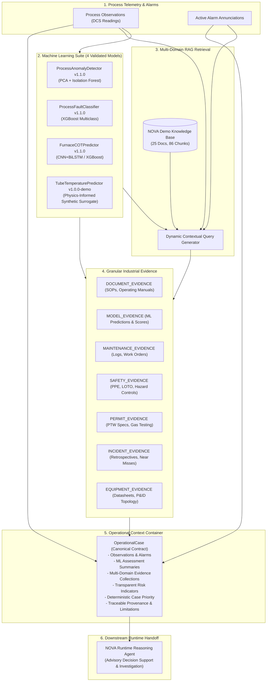

# NOVA Operational Intelligence Context Layer Architecture

## 1. Overview & Conceptual Architecture

The NOVA Operational Intelligence Context Layer serves as the unified bridge between raw industrial telemetry observations, machine learning predictive models, and multi-domain engineering knowledge. It packages heterogeneous process data into a single canonical `OperationalCase` object for downstream runtime reasoning.



---

## 2. Ownership & Operational Boundaries

| Workstream | Owner | Responsibilities & Scope |
| :--- | :--- | :--- |
| **ML + RAG + Knowledge + Operational Context** | **Arushi** | - 4 ML predictive models & inference pipelines<br>- Knowledge ingestion, normalization, chunking, indexing & RAG retrieval<br>- Evidence extraction, classification, and provenance tracing<br>- `OperationalCase` construction, risk indicators, and deterministic priority |
| **Runtime Orchestration & Execution** | **Runtime Engineer** | - Runtime agent execution, state machine transitions<br>- Human-in-the-loop decision capture & advisory presentation<br>- User interface integration & operator notifications |

> [!IMPORTANT]
> **Advisory-Only Safety Rule**: The Operational Intelligence Context Layer produces grounded, traceable decision-support evidence. It does NOT execute autonomous plant actions, approve permits, modify setpoints, or send control commands to physical controllers.

---

## 3. Data Model Specifications

### 3.1 Observation Model vs. ML Predictions
Physical process observations are strictly separated from model conclusions:
- **`Observation`**: Represents directly observed sensor readings (e.g., `TI-201 = 888.5 °C`, `unit = "°C"`, `source = "telemetry"`, `is_synthetic = true`).
- **`MLAssessmentSummary`**: Represents inference outputs from the 4 ML models.
- **`TubeTemperaturePredictor` Synthetic Surrogate Notice**: Predictions from Model 4 are explicitly labeled with `target_type: "physics_informed_synthetic_surrogate"` and `industrial_validation: false` to ensure no synthetic output is mistaken for physical plant telemetry.

### 3.2 Granular Evidence Categories
All retrieved knowledge and model outputs are classified into 7 distinct evidence types:
1. `DOCUMENT_EVIDENCE`: Authoritative standard operating procedures, operating manuals, and engineering guidelines.
2. `MODEL_EVIDENCE`: ML model predictions, anomaly scores, and classification confidences.
3. `MAINTENANCE_EVIDENCE`: Historical work orders, inspection reports, decoking logs, and calibration records.
4. `SAFETY_EVIDENCE`: Personal protective equipment (PPE) matrices, lockout/tagout (LOTO) energy isolation rules, and toxic vapor release protocols.
5. `PERMIT_EVIDENCE`: Applicable Permit-to-Work (PTW) specifications, hot work controls, gas testing requirements, and fire watch rules.
6. `INCIDENT_EVIDENCE`: Major incident root cause analyses and process safety near-miss reports.
7. `EQUIPMENT_EVIDENCE`: Engineering datasheets, P&ID stream topologies, and asset hierarchy directories.

---

## 4. Transparent Risk Indicators & Deterministic Priority

### 4.1 Risk Indicator Framework
NOVA rejects ungrounded, black-box AI risk percentages. Instead, it evaluates explicit, interpretable risk indicators:

| Indicator Name | Source | Condition / Evaluation | Severity Contribution |
| :--- | :--- | :--- | :--- |
| `COT_above_emergency_trip` | Telemetry `TI-201` | Measured COT $\ge 895.0\ ^\circ\text{C}$ | `CRITICAL` |
| `TMT_estimate_critical` | Model 4 Surrogate | Estimated TMT $\ge 1080.0\ ^\circ\text{C}$ | `CRITICAL` |
| `COT_above_alarm_threshold`| Telemetry `TI-201` | Measured COT $\ge 885.0\ ^\circ\text{C}$ | `HIGH` |
| `TMT_estimate_elevated` | Model 4 Surrogate | Estimated TMT $\ge 1040.0\ ^\circ\text{C}$ | `HIGH` |
| `anomaly_detected` | Model 1 (PCA+IF) | Anomaly flag is True (Score $>0.80 \rightarrow \text{HIGH}$, else $\text{MEDIUM}$) | `HIGH` / `MEDIUM` |
| `fault_classified` | Model 2 (XGBoost) | Diagnosed non-normal fault with confidence $\ge 0.70$ | `HIGH` / `MEDIUM` |
| `active_alarms_present` | DCS Alarm System | Active alarms present on target equipment | `HIGH` / `MEDIUM` |
| `permit_controls_applicable`| `DOC-DEMO-PMT-SOP-025`| Work requires hot work permit or physical LOTO isolation | `MEDIUM` |
| `historical_incident_match`| `DOC-DEMO-INC-F201-023`| Matching failure mechanism in incident database | `LOW` |

### 4.2 Case Priority Classification Rules
Case priority is evaluated deterministically from the set of active risk indicator severities:
- **`CRITICAL`**: If any indicator has `CRITICAL` severity (e.g., emergency trip exceeded, toxic gas release alert).
- **`HIGH`**: If any indicator has `HIGH` severity (e.g., high alarm exceeded, high-confidence fault).
- **`MEDIUM`**: If any indicator has `MEDIUM` severity (e.g., anomaly detected, open permit requirement).
- **`LOW`**: If any indicator has `LOW` severity (e.g., historical match, minor sensor deviation).
- **`INFO`**: Normal steady-state operation with all indicators within nominal limits.

---

## 5. Case Lifecycle States

```
NEW  ──►  ASSESSING  ──►  EVIDENCE_GATHERED  ──►  READY_FOR_REVIEW  ──►  CLOSED
```

1. **`NEW`**: Case initialized with raw telemetry observations and asset identifiers.
2. **`ASSESSING`**: ML inference pipeline executing across all 4 model components.
3. **`EVIDENCE_GATHERED`**: Multi-domain RAG retrieval completed across documents, safety, maintenance, permits, and incidents.
4. **`READY_FOR_REVIEW`**: Fully assembled case ready for runtime inspection and operator decision support.
5. **`CLOSED`**: Case marked complete by authorized human operator.

---

## 6. Canonical Demo Scenarios

The `ScenarioBuilder` provides 4 reproducible scenarios under [`backend/operational_context/scenarios.py`](file:///c:/Users/Aarushi%20Sachdeva/OneDrive/Desktop/nova/backend/operational_context/scenarios.py):

1. **`SCENARIO-1-HIGH-COT`**:
   - Asset: `F-201A`
   - Trigger: Measured COT $888.5\ ^\circ\text{C}$ ($>885.0\ ^\circ\text{C}$ alarm), high alarm `ALM-TI-201-AH`.
   - Evidence: `DOC-DEMO-ALM-F201-002` (High COT Alarm Response), `DOC-DEMO-SOP-F201-001`, `DOC-DEMO-SAF-GEN-012` (LOTO).
   - Priority: `HIGH`.
2. **`SCENARIO-2-PROCESS-ANOMALY`**:
   - Asset: `F-201A`
   - Trigger: Reactor cooling water temperature excursion ($42.8\ ^\circ\text{C}$) and flow disturbance.
   - Evidence: Model 1 Anomaly, Model 2 Fault 4 (Reactor Cooling Water Step Decrease), `DOC-DEMO-OPM-FLT-008`.
   - Priority: `MEDIUM`.
3. **`SCENARIO-3-MAINTENANCE`**:
   - Asset: `F-201A`
   - Trigger: Scheduled radiant coil decoke cycle and pyrometer recalibration (`WO-2025-0882`).
   - Evidence: `DOC-DEMO-MNT-HIS-022`, `DOC-DEMO-MNT-F201-018`, `DOC-DEMO-PMT-SOP-025` (Class A Hot Work).
   - Priority: `MEDIUM`.
4. **`SCENARIO-4-SAFETY-EVENT`**:
   - Asset: `UNIT-CRACK-01` (`F-201A` Burner Bay)
   - Trigger: Combustible gas detection alert ($22\%\text{ LEL} > 20\%\text{ LEL}$ limit).
   - Evidence: `DOC-DEMO-SAF-GEN-011` (Vapor Release SOP), `DOC-DEMO-SAF-GEN-013` (PPE Matrix), `DOC-DEMO-EMG-GEN-014`.
   - Priority: `HIGH`.

---

## 7. Public API & Runtime Output Contract

Runtime consumes the operational context via a single clean API:

```python
from backend.operational_context import build_operational_case, ScenarioBuilder

# 1. Build from live/streamed observations
case = build_operational_case(
    telemetry={"TI-201": 888.5, "PI-201": 0.34, "FC-201": 24000.0},
    equipment_id="F-201A",
    alarms=[{"alarm_id": "ALM-TI-201-AH", "severity": "HIGH", "message": "High COT"}],
)

# 2. Or build from a canonical scenario
case = ScenarioBuilder.build_case_from_scenario("SCENARIO-1-HIGH-COT")

print(case.priority)          # CasePriority.HIGH
print(case.status)            # CaseStatus.READY_FOR_REVIEW
print(len(case.knowledge_evidence))   # SOP & Operating manual evidence
print(len(case.safety_context))       # LOTO & PPE evidence
print(len(case.permit_context))       # Hot work PTW specifications
```
