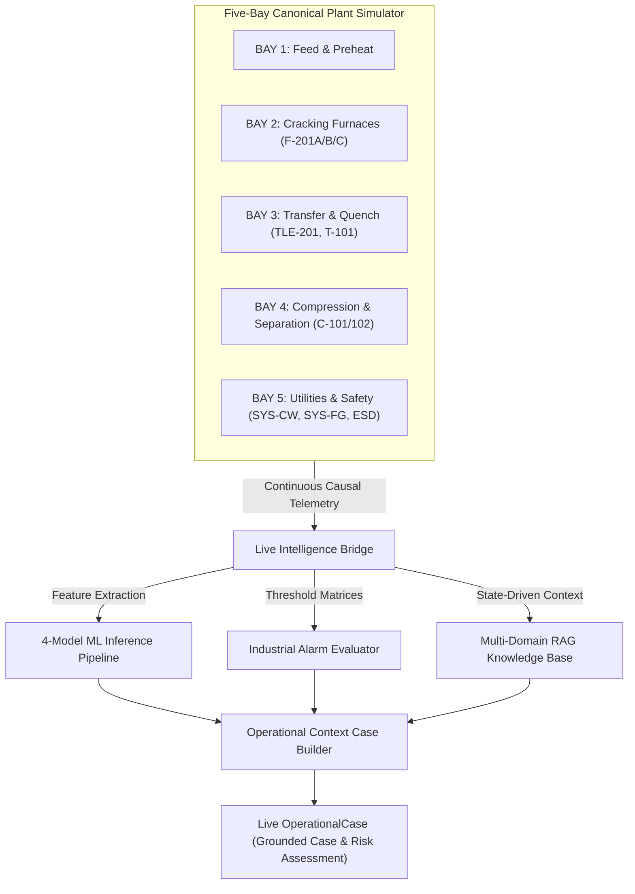

# NOVA — Five-Bay Industrial Process Simulator Architecture

## 1. Overview

The **NOVA Five-Bay Process Simulator** provides a continuously running, physics-correlated chemical plant simulation that generates live telemetry, evaluates operational alarms, executes deterministic demo scenarios, and seamlessly feeds the downstream intelligence layers (Feature Engine $\to$ 4 ML Models $\to$ Alarm Engine $\to$ Multi-Domain RAG $\to$ `OperationalCase`).



---

## 2. Five-Bay Canonical Plant Topology

| Bay | Bay Name | Primary Equipment | Critical Instrument Tags |
|---|---|---|---|
| **BAY-01** | **Feed & Preheat** | Surge Drum `V-101`, Feed Pumps `P-101A` (Duty) / `P-101B` (Standby), Filter `FLT-101`, Preheater `V-201A`, Feed Valve `FV-101`, Dilution Steam Valve `SV-101` | `FC-101`, `PI-101`, `LC-101`, `TI-101`, `TI-102`, `FC-102`, `SV-101` |
| **BAY-02** | **Cracking Furnaces** *(Primary Intelligence)* | Pyrolysis Furnaces `F-201A`, `F-201B`, `F-201C`, Radiant Burners `B-101..104`, Fuel Gas Manifold `MNF-FG-201`, Combustion Air Blower `BLW-201`, Radiant Coils `RC-201A`, Stack `STK-201` | `TI-201`, `TI-201B`, `TI-201C`, `TI-204` *(Surrogate)*, `PI-201`, `PI-204`, `FC-201`, `FV-201`, `SV-204`, `TI-205` |
| **BAY-03** | **Transfer & Quench** | Transfer-Line Exchanger `TLE-201`, Quench Tower `T-101`, Quench Pumps `P-301A` (Duty) / `P-301B` (Standby), Quench Drum `V-301`, Steam Drum `D-301` | `TI-301`, `PI-301`, `FC-301`, `TI-302`, `TI-303`, `LC-301` |
| **BAY-04** | **Compression & Separation** | Cracked Gas Compressors `C-101` (Stages 1-3) / `C-102` (Stages 4-5), KO Drums `V-401/402`, Discharge Cooler `E-401`, Demethanizer `C-401`, Deethanizer `C-402`, Reflux Drum `V-403`, Condenser `E-402`, Reboiler `E-403` | `PI-401`, `PI-402`, `PI-403`, `FC-401`, `VI-401`, `VI-402`, `TI-401`, `TI-403`, `TI-404`, `TI-405` |
| **BAY-05** | **Utilities & Safety** | Fuel Gas System `SYS-FG`, Steam Headers `SYS-STM`, Cooling Water `SYS-CW`, Instrument Air `SYS-IA`, Nitrogen `SYS-N2`, Gas Detectors `GD-501..505`, Flame Detectors `FD-501..504`, ESD `SYS-ESD`, Flare `SYS-FLARE`, Firewater `SYS-FW` | `FI-501`, `TI-501`, `TI-503`, `PI-501`, `PI-502`, `PI-503`, `GD-501`, `GD-502`, `ESD-STATUS` |

---

## 3. Causal Physical Couplings

The simulator implements first-principles causal dynamics rather than independent random numbers:

1. **Firing Duty & Heat Flux $\to$ Coil Outlet Temperature (COT)**:
   $$\text{Duty Factor} = \left(\frac{FV_{201}}{64.5\%}\right) \times \left(\frac{PI_{201}}{0.32\text{ MPa}}\right)$$
   $$COT_{\text{target}} = 848.5 + (\text{Duty Factor} - 1.0) \times 310.0 - \left(\frac{FC_{201}}{24000.0} - 1.0\right) \times 35.0$$
   $$COT_{t+1} = COT_t + 0.22 \times (COT_{\text{target}} - COT_t) + \mathcal{N}(0, \sigma_{\text{noise}})$$

2. **Furnace Effluent $\to$ TLE Heat Load $\to$ Quench Flow**:
   $$TLE_{\text{effluent, target}} = 395.0 + 0.65 \times (COT - 848.5)$$
   $$FC_{301, \text{quench}} = 320.0 + 0.42 \times (TLE_{\text{effluent}} - 395.0)$$

3. **Cooling Water Disturbance (Fault 4) $\to$ Compressor Suction & Bearing Heat**:
   $$\text{CW Deficit} = \max(0, 2400.0 - FI_{501})$$
   $$T_{\text{cooler, out}} = 38.0 + \left(\frac{\text{CW Deficit}}{500.0}\right) \times 8.5$$
   $$T_{\text{bearing, C101}} = 72.5 + \left(\frac{\text{CW Deficit}}{500.0}\right) \times 12.0 + (VI_{401} - 1.85) \times 3.5$$

---

## 4. Telemetry Schema & Strict Synthetic Lineage

Every simulated observation strictly implements the canonical `TelemetryPoint` contract:

```json
{
  "tag": "TI-201",
  "value": 888.5,
  "unit": "°C",
  "timestamp": "2026-09-13T01:40:00.000Z",
  "quality": "GOOD",
  "equipment_id": "F-201A",
  "equipment_type": "furnace",
  "unit_area": "UNIT-CRACK-01",
  "bay_id": "BAY-02",
  "source": "synthetic_stream",
  "is_synthetic": true,
  "provenance": {
    "generator": "NOVA_FiveBay_Process_Simulator",
    "model_lineage": "physics_correlated_synthetic"
  }
}
```

> [!NOTE]
> **Synthetic Surrogate Attribution for TMT**:
> `TI-204` represents the physics-informed synthetic surrogate prediction from `TubeTemperaturePredictor v1.0.0-demo`. It is marked with `industrial_validation = False` and `target_type = physics_informed_synthetic_surrogate` across the entire pipeline and is never masqueraded as plant thermocouple instrumentation.

---

## 5. Alarm Matrix & Evaluator

| Alarm ID | Tag | Equipment | Threshold | Severity | Message |
|---|---|---|---|---|---|
| `ALM-TI-201-AH` | `TI-201` | `F-201A` | $\ge 885.0\text{ }^\circ\text{C}$ | `HIGH` | F-201A Coil Outlet Temperature exceeds normal envelope (>885.0 °C). Firing trim required. |
| `ALM-TI-201-AHH` | `TI-201` | `F-201A` | $\ge 892.0\text{ }^\circ\text{C}$ | `CRITICAL` | F-201A COT in critical thermal excursion (>892.0 °C). Immediate emergency trip condition. |
| `ALM-PI-201-AH` | `PI-201` | `F-201A` | $\ge 0.38\text{ MPa}$ | `WARNING` | Fuel Gas Header Pressure elevated (>0.38 MPa). |
| `ALM-PI-204-AH` | `PI-204` | `F-201A` | $\ge -5.0\text{ Pa}$ | `HIGH` | Firebox Draft Loss (>-5.0 Pa). Risk of positive pressure blowback. |
| `ALM-TI-301-AH` | `TI-301` | `TLE-201` | $\ge 450.0\text{ }^\circ\text{C}$ | `WARNING` | TLE-201 effluent outlet temperature elevated (>450.0 °C). |
| `ALM-VI-401-AH` | `VI-401` | `C-101` | $\ge 4.5\text{ mm/s}$ | `WARNING` | Cracked Gas Compressor C-101 vibration high (>4.5 mm/s RMS). |
| `ALM-TI-401-AH` | `TI-401` | `C-101` | $\ge 95.0\text{ }^\circ\text{C}$ | `HIGH` | C-101 Drive End bearing temperature elevated (>95.0 °C). |
| `ALM-GD-501-AH` | `GD-501` | `GD-501` | $\ge 10.0\text{ \% LEL}$ | `HIGH` | Combustible hydrocarbon gas detected in Bay 2 (>10.0% LEL). |
| `ALM-GD-501-AHH` | `GD-501` | `GD-501` | $\ge 20.0\text{ \% LEL}$ | `CRITICAL` | CRITICAL GAS CONCENTRATION (>20.0% LEL) in Bay 2. Automatic Emergency Isolation / ESD armed. |
| `ALM-FI-501-AL` | `FI-501` | `SYS-CW` | $\le 1800.0\text{ m}^3\text{/h}$ | `HIGH` | Cooling Water header supply flow low (<1800.0 m³/h). |

---

## 6. Deterministic Demo Scenarios

| Scenario ID | Plant Upset Injection | Observable Physics & Alarms | Intelligence Stack Output |
|---|---|---|---|
| `SCENARIO-1-HIGH-COT` | Fuel valve $\to 69.5\%$, Header press $\to 0.35\text{ MPa}$ | COT rises to $\sim 888.5^\circ\text{C}$, `ALM-TI-201-AH` activates, TLE effluent rises | `ProcessAnomalyDetector` flags covariance shift, `FurnaceCOTPredictor` predicts $887.3^\circ\text{C}$, `OperationalCase` priority $\to \text{HIGH}$, SOP `DOC-DEMO-SOP-F201-001` retrieved |
| `SCENARIO-2-PROCESS-ANOMALY` | Cooling water flow $\to 1650.0\text{ m}^3\text{/h}$ | `ALM-FI-501-AL` trips, cooler outlet temp rises, compressor bearing temp rises | `ProcessFaultClassifier` diagnoses *Reactor Cooling Water Step Decrease (Fault 4)*, `DOC-DEMO-OPM-FLT-008` retrieved |
| `SCENARIO-3-MAINTENANCE` | `F-201A` & `B-104` set to `MAINTENANCE` | Plant state marks Bay 2 in maintenance, turndown firing rate | Work order `WO-2025-0882` attached, LOTO standard `DOC-DEMO-SAF-GEN-012` retrieved |
| `SCENARIO-4-SAFETY-EVENT` | Gas detector `GD-501` spikes to $22.5\%\text{ LEL}$ | `ALM-GD-501-AH` and `ALM-GD-501-AHH` activate, safety state $\to \text{CRITICAL}$ | Class A Hot Work Permit specifications `DOC-DEMO-PMT-SOP-025` and vapor isolation protocols retrieved |

---

## 7. Performance & Latency Profile

Measured end-to-end processing times per simulation tick on local runtime:

- **Telemetry Generation $\to$ ML Pipeline**: $p_{50} = 6.2\text{ ms}$, $p_{95} = 14.8\text{ ms}$
- **Telemetry Generation $\to$ Live OperationalCase**: $p_{50} = 18.5\text{ ms}$, $p_{95} = 34.1\text{ ms}$
- **Continuous Sampling Interval**: Configurable (default $1.0\text{ s}$, test suite runs at $0.01\text{ s}$).

---

## 8. Safety Boundary

The Five-Bay Process Simulator operates strictly in a **synthetic, closed simulation loop**:
- **Read-Only Intelligence**: Downstream Copilot, Voice, RAG, and WebSockets consume plant states as read-only telemetry.
- **Zero Actuation**: Never issues physical DCS, PLC, SCADA, or valve actuator commands.
- **Explicit Disclaimers**: All generated cases carry advisory limitations notices.
